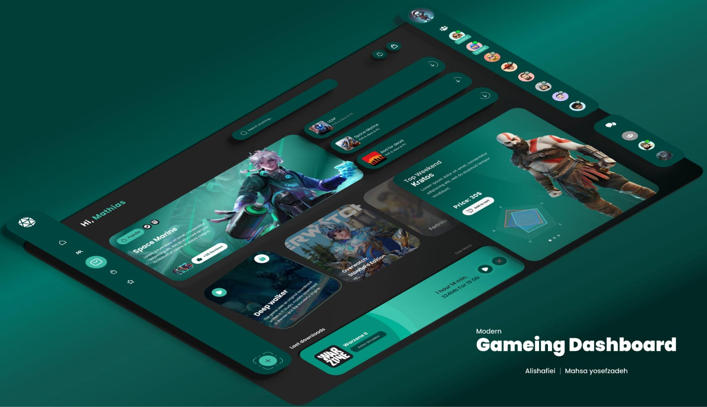

# Gaming_Dashboard

Veja a sua Plataforma Favorita de Jogos!

<h1 align="center"> Gaming DashBoard </h1>

<a>Projeto feito com a proposta de melhorar minhas Habilidates de Responsividade com Grid.</a>

 <a href="#-tecnologias">Tecnologias</a>&nbsp;&nbsp;&nbsp;| &nbsp;&nbsp;&nbsp;
 <a href="#-projeto">Projeto</a>&nbsp;&nbsp;&nbsp;| &nbsp;&nbsp;&nbsp;
 <a href="#-layout">Layout</a>&nbsp;&nbsp;&nbsp;| &nbsp;&nbsp;&nbsp;
  <a href="#memo-licença">Licença</a>

 

 

  

## 🚀 Tecnologias

Esse projeto foi desenvolvido com as seguintes tecnologias:

- HTML e CSS ( Grid )
- Git e Github
- Figma

## 💻 Projeto

Uma platafor que mostra suas perfermases em pontuações e conquistas. Além de mostrar os melhores jogos do momento.

- [Acesse o projeto finalizado, online] através [DESSE LINK](https://vinivy.github.io/Gaming_Dashboard/)

## 🔖 Layout

Você pode visualizar o layout do projeto através [DESSE LINK](https://www.frontendmentor.com) para acessá-lo.

## :memo: Licença

Esse projeto está sob a licença MIT.
